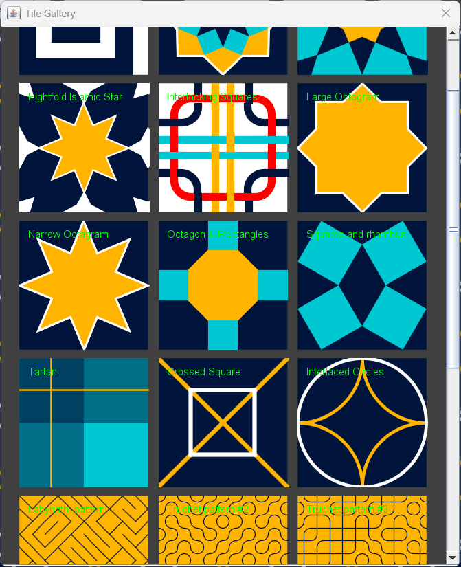

# Introduction
The *SquareTiling* application provides an interactive graphical interface to visualize periodic tilings composed of repeated square-based geometric patterns. 

*SquareTiling* includes tiles like Greek key, Islamic stars, octagons, checkers, fractals, Truchet patterns, Wang tiling, tartan and interlaced motifs, which can be tiled across the application panel in real time. 

You can adjust tile size, choose from four customizable colors, preview individual tiles, export the resulting tiling as a PNG image and view the gallery of implemented tiles. All tiles are implemented using standard Java 2D classes.

Create your own tile using **user mode** that allows you to draw lines and arcs, fill colors, build and visualize your own tilings in real time.

# How to run
Run 'ant' command to compile and run the *SquareTiling* application.

# Screenshot
Islamic tile example:


**User mode** example:


**Tiles gallery**:



# Tilings
The following tilings are available:

| Method | Description |
|--------|-------------|
| `drawGreekTile` | Greek Pattern |
| `drawIslamicStarTile1/2/3` | Layered/Quartered/Eightfold Islamic Stars |
| `drawInterlockingTile` | Interlocking Squares |
| `drawOctagramTile` | Large and Narrow Octagram |
| `drawOctagonTile` | Octagons & Squares; Octagon & Rhombus |
| `drawSquaresTile` | Squares and Rhombus |
| `drawTartanTile` | Tartan |
| `drawCrossedTile` | Crossed Square |
| `drawInterlacedTile` | Interlaced Circles |
| `drawLabyrinthTile` | Labyrinth  pattern |
| `drawTruchetTile` | Truchet pattern #2, #3, #4 |
| `drawWangTile` | Wang tiling |
| `drawBlockFractal` | Block fractal |
| `drawHilbertFractal` | Hilbert fractal |
| `drawGridSquareCircles` | Grid Squares & Circles |
| `drawCheckeredTile` | Checkered |


# How to use methods from other Java AWT apps
Methods described in previous sections requires Java AWT. These methods are static and can be invoked as in the following example:
```java
Tiles.drawGreekTile(g2d, colors, x, y, size);
```
Where *g2d* is a reference to Graphics2D, *x* and *y* are the origin for the tile, *size* is the size of square tile. Some methods may have additional parameters to control specific features of the tile.

