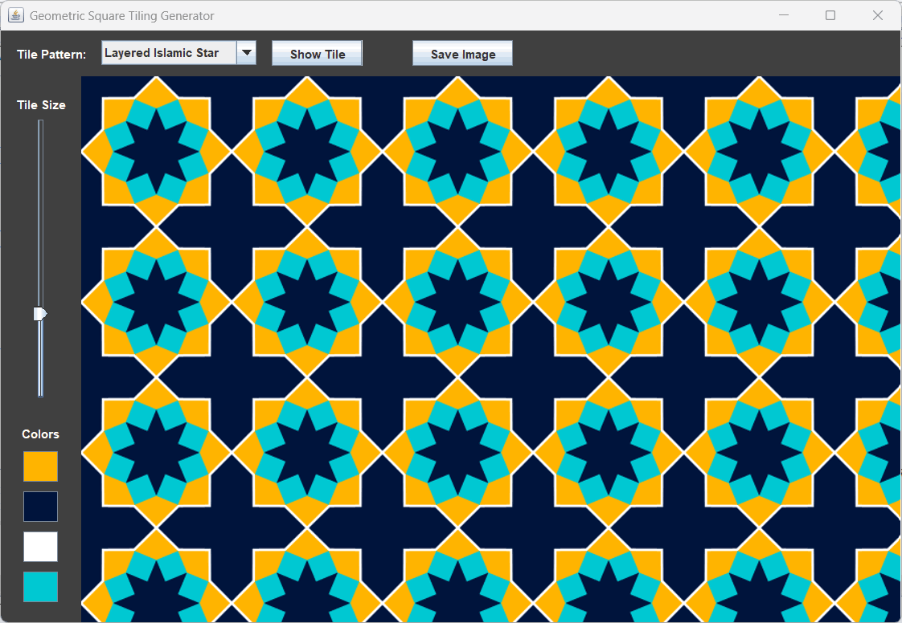

# Introduction
The *SquareTiling* application provides an interactive graphical interface for visualizing periodic tilings composed of repeated square-based geometric patterns. 

*SquareTiling* includes tiles like Greek key, Islamic stars, octagons, checkers, fractals, tartan and interlaced motifs, which can be tiled across the application panel in real time. 

You can adjust tile size, choose from four customizable colors, preview individual tiles and export the resulting tiling as a PNG image. 

Create your own tile using **user mode** that allows you to draw lines, fill colors, to build and visualize your own tilings in real time.

# How to run
Run 'ant' command to compile and run the *SquareTiling* application.

# Screenshot
Islamic tile example:

**User mode** example:

# Todo
- Extend tiling to rectangles
- Extend user mode with arcs
- Improve flood fill algorithm
- Add more tiles
